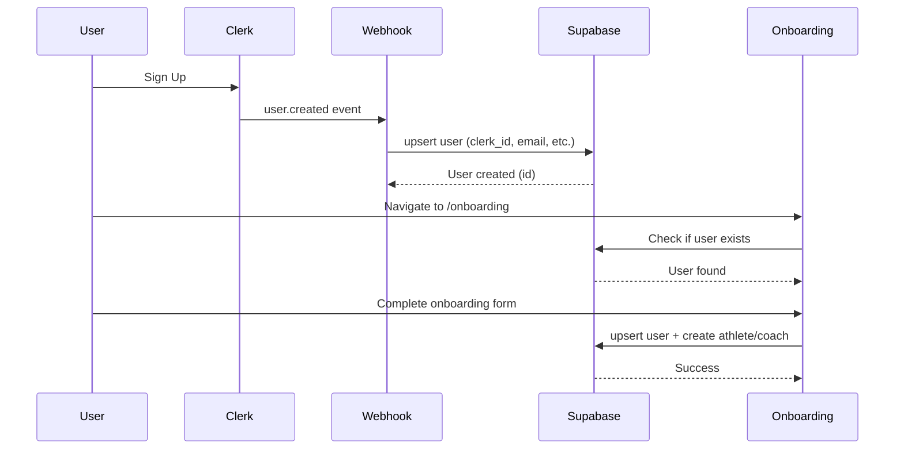

# Onboarding Workflow Verification Report

## Overview
This document verifies the complete onboarding workflow and data synchronization between Clerk, Supabase, and the application.

**Supabase Project**: `pcteaouusthwbgzczoae` (Sprint Dev)
**Date**: 2025-12-22

## Data Flow Analysis

### 1. User Signup Flow



### 2. Current Implementation Status

#### ✅ Webhook Handler (`/api/auth/webhook`)
- **Status**: ✅ Implemented and deployed
- **User Creation**: Uses `upsert` with `onConflict: 'clerk_id'` (idempotent)
- **Events Handled**:
  - `user.created` ✅
  - `user.updated` ✅
  - `user.deleted` ✅
  - `organizationMembership.created` ✅
  - `organizationMembership.updated` ✅
  - `organizationMembership.deleted` ✅

#### ✅ Onboarding Action (`completeOnboardingAction`)
- **Status**: ✅ Implemented
- **User Update**: Uses `upsert` with `onConflict: 'clerk_id'`
- **Role-Specific Data**:
  - Athletes: Creates/updates `athletes` table ✅
  - Coaches: Creates/updates `coaches` table ✅

#### ✅ Database Schema Verification

**Users Table** (`pcteaouusthwbgzczoae`):
- ✅ `clerk_id` (text, nullable, unique) - Matches code
- ✅ `email` (varchar, NOT NULL) - Matches code
- ✅ `username` (varchar, NOT NULL) - Matches code
- ✅ `first_name`, `last_name` (text, nullable) - Matches code
- ✅ `role` (text, NOT NULL) - Matches code
- ✅ `onboarding_completed` (boolean, default: false) - Matches code
- ✅ `birthdate` (date, nullable) - Matches code
- ✅ `timezone` (text, NOT NULL) - Matches code
- ✅ `subscription_status` (varchar, default: 'free') - Matches code
- ✅ `metadata` (jsonb, nullable) - Matches code

**Athletes Table**:
- ✅ `user_id` (integer, nullable) - Matches code
- ✅ `height` (real, nullable) - Matches code
- ✅ `weight` (real, nullable) - Matches code
- ✅ `training_goals` (text, nullable) - Matches code
- ✅ `experience` (text, nullable) - Matches code
- ✅ `events` (jsonb, nullable) - Matches code

**Coaches Table**:
- ✅ `user_id` (integer, nullable) - Matches code
- ✅ `speciality` (text, nullable) - Matches code
- ✅ `sport_focus` (text, nullable) - Matches code
- ✅ `philosophy` (text, nullable) - Matches code
- ✅ `experience` (text, nullable) - Matches code

### 3. Potential Issues Found

#### ⚠️ Issue 1: Supabase Client Connection
**Location**: `apps/web/lib/supabase-server.ts`
- **Status**: ✅ Uses environment variables correctly
- **Connection**: Uses `process.env.NEXT_PUBLIC_SUPABASE_URL` and `process.env.NEXT_PUBLIC_SUPABASE_ANON_KEY`
- **Verification Needed**: Ensure these are set to `pcteaouusthwbgzczoae` project, not placeholders

#### ⚠️ Issue 2: Onboarding Action Uses RLS Client
**Location**: `apps/web/actions/onboarding/onboarding-actions.ts`
- **Current**: Uses `supabase` from `@/lib/supabase-server` (RLS-enabled client)
- **Potential Issue**: If user doesn't exist yet, RLS might block the upsert
- **Solution**: The webhook should create the user first (which it does), so this should be fine
- **Verification**: Test that onboarding works when user is created by webhook

#### ⚠️ Issue 3: Username Generation
**Location**: `apps/web/components/features/onboarding/onboarding-wizard.tsx:138`
```typescript
username: userData.firstName.toLowerCase() + (userData.lastName ? userData.lastName.charAt(0).toLowerCase() : '')
```
- **Issue**: This might create duplicate usernames
- **Database**: `username` is NOT NULL but not unique in schema
- **Recommendation**: Add unique constraint or use email-based username

#### ⚠️ Issue 4: Missing Error Handling in Onboarding Wizard
**Location**: `apps/web/components/features/onboarding/onboarding-wizard.tsx:172-177`
- **Issue**: Errors are logged but not shown to user
- **TODO Comments**: "TODO: Show error message to user"
- **Impact**: User won't know if onboarding fails

### 4. Data Sync Verification Checklist

#### Webhook → Supabase Sync
- [x] Webhook handler uses `upsert` (idempotent)
- [x] Webhook creates user with `onboarding_completed: false`
- [x] Webhook sets default role: `'athlete'`
- [x] Webhook sets default timezone: `'UTC'`
- [x] Webhook generates username from email if no name

#### Onboarding → Supabase Sync
- [x] Onboarding action uses `upsert` for user (idempotent)
- [x] Onboarding sets `onboarding_completed: true`
- [x] Onboarding creates/updates athlete record (if role = athlete)
- [x] Onboarding creates/updates coach record (if role = coach)
- [x] Onboarding preserves existing user data (upsert)

#### Data Consistency
- [x] Both webhook and onboarding use `clerk_id` as conflict key
- [x] User record is created before athlete/coach records
- [x] All required fields have defaults or are nullable

### 5. Connection Verification

#### Supabase Client Configuration
**File**: `apps/web/lib/supabase-server.ts`
- ✅ Uses `process.env.NEXT_PUBLIC_SUPABASE_URL` (not hardcoded)
- ✅ Uses `process.env.NEXT_PUBLIC_SUPABASE_ANON_KEY` (not hardcoded)
- ✅ Uses Clerk JWT token via `auth().getToken()`
- ⚠️ **Action Required**: Verify env vars point to `pcteaouusthwbgzczoae`

#### Service Role Client (Webhooks)
**File**: `apps/web/lib/supabase-service.ts`
- ✅ Uses `process.env.NEXT_PUBLIC_SUPABASE_URL`
- ✅ Uses `process.env.SUPABASE_SERVICE_ROLE_KEY`
- ✅ Fails fast if env vars missing
- ⚠️ **Action Required**: Verify `SUPABASE_SERVICE_ROLE_KEY` is set for `pcteaouusthwbgzczoae`

### 6. Recommended Fixes

#### Priority 1: Critical
1. **Add Error UI in Onboarding Wizard**
   - Show error messages to users when onboarding fails
   - Replace TODO comments with actual error handling

2. **Verify Environment Variables**
   - Ensure `NEXT_PUBLIC_SUPABASE_URL` points to `https://pcteaouusthwbgzczoae.supabase.co`
   - Ensure `SUPABASE_SERVICE_ROLE_KEY` is for the correct project

#### Priority 2: Important
3. **Username Uniqueness**
   - Add unique constraint to `username` column OR
   - Use email-based username generation with fallback

4. **Add Transaction Wrapper**
   - Wrap user + athlete/coach creation in a transaction
   - Rollback if any step fails

#### Priority 3: Nice to Have
5. **Add Validation**
   - Validate required fields before database operations
   - Better error messages for validation failures

### 7. Testing Checklist

- [ ] Test: User signup → Webhook creates user → Onboarding completes
- [ ] Test: User signup → Onboarding completes (webhook delayed)
- [ ] Test: User updates profile → Webhook syncs changes
- [ ] Test: Athlete onboarding → Verify athlete record created
- [ ] Test: Coach onboarding → Verify coach record created
- [ ] Test: Duplicate username handling
- [ ] Test: Error handling when Supabase is down

### 8. Security Advisors Found

From Supabase security advisors:
1. ⚠️ `ai_memories` table has RLS enabled but no policies
2. ⚠️ Function `update_athlete_personal_bests_updated_at` has mutable search_path
3. ⚠️ Extension `vector` in public schema (should be in separate schema)
4. ⚠️ Postgres version has security patches available (15.8.1.102)

**Note**: These don't affect onboarding workflow but should be addressed.

