# Coach E2E Walkthrough Runbook

> Full end-to-end test plan for the coach workflow: onboarding → groups/subgroups → templates/AI parser → season planning.
> Covers functional verification, UX critique (coach persona), screenshots, and the `/demo/coach` walkthrough page.

**Created**: 2026-03-15
**Status**: Draft
**Tools**: Clerk API, agent-browser CLI, Supabase MCP

---

## Table of Contents

1. [Overview](#overview)
2. [Test Infrastructure](#test-infrastructure)
3. [Coach Persona](#coach-persona)
4. [E2E Test Stages](#e2e-test-stages)
   - [Stage 1: Account Creation & Auth](#stage-1-account-creation--auth)
   - [Stage 2: Onboarding Wizard](#stage-2-onboarding-wizard)
   - [Stage 3: Dashboard First Impression](#stage-3-dashboard-first-impression)
   - [Stage 4: Group Creation](#stage-4-group-creation)
   - [Stage 5: Subgroup Creation & Athlete Assignment](#stage-5-subgroup-creation--athlete-assignment)
   - [Stage 6: Exercise Library](#stage-6-exercise-library)
   - [Stage 7: Template Creation via AI Parser](#stage-7-template-creation-via-ai-parser)
   - [Stage 8: Season Plan Creation](#stage-8-season-plan-creation)
   - [Stage 9: Session Editing & AI Assistant](#stage-9-session-editing--ai-assistant)
5. [Onboarding Review & Improvements](#onboarding-review--improvements)
6. [Walkthrough Page Spec: /demo/coach](#walkthrough-page-spec-democoach)
7. [Execution Checklist](#execution-checklist)

---

## Overview

### Goals

1. **Functional E2E**: Verify the entire coach journey works end-to-end — no broken links, no dead ends, no server errors
2. **UX Critique**: Evaluate each stage through a coach persona lens — is it intuitive? Is the next action obvious? Are empty states helpful?
3. **Screenshot Evidence**: Capture critical screens for the walkthrough page
4. **Walkthrough Page**: Build `/demo/coach` (public, marketing route group) with screenshots and guided narrative
5. **Onboarding Polish**: Review and improve onboarding steps 3-4 for coach-specific clarity

### What This Is NOT

- Not a regression test suite (no assertions/selectors to maintain)
- Not automated CI (manual agent-browser sessions)
- Not covering athlete or individual flows

---

## Test Infrastructure

### Auth Setup (Clerk API)

```bash
# Create a sign-in token for the test coach user
curl -X POST https://api.clerk.com/v1/sign_in_tokens \
  -H "Authorization: Bearer $CLERK_SECRET_KEY" \
  -H "Content-Type: application/json" \
  -d '{"user_id": "<test_coach_user_id>"}'

# Extract the URL from the response
# Open in agent-browser to establish authenticated session
agent-browser open "$SIGN_IN_URL"
```

For a **fresh coach account** (new onboarding), create a new Clerk user first:
```bash
curl -X POST https://api.clerk.com/v1/users \
  -H "Authorization: Bearer $CLERK_SECRET_KEY" \
  -H "Content-Type: application/json" \
  -d '{
    "email_address": ["test-coach-e2e@kasoku.run"],
    "password": "TestCoach2026!",
    "first_name": "Coach",
    "last_name": "Demo"
  }'
```

### Browser CLI

```bash
# All commands use the same session for cookie persistence
agent-browser --session coach-e2e open <url>
agent-browser --session coach-e2e snapshot -i -c
agent-browser --session coach-e2e screenshot /tmp/demo/coach/<stage>-<name>.png
agent-browser --session coach-e2e click @<ref>
agent-browser --session coach-e2e fill @<ref> "<text>"
```

### Supabase MCP

Use for:
- Verifying database state after actions (rows created, relationships correct)
- Cleaning up test data between runs
- Checking RLS policies are working (coach can only see own data)

### Screenshot Convention

All screenshots saved to: `apps/web/public/demo/coach/`
Naming: `<NN>-<stage>-<description>.png` (e.g., `01-onboarding-welcome.png`)

---

## Coach Persona

**Name**: Coach Tanaka
**Background**: Sprint coach with 8 years of experience, coaching a university team of 15 athletes. Specializes in 100m/200m sprints and hurdles. Manages athletes in subgroups by event (Short Sprints, Long Sprints, Hurdles).
**Tech comfort**: Uses phone and laptop daily, familiar with basic apps (Google Sheets, WhatsApp). Not a power user — needs obvious UI cues.
**Goal**: Set up the platform to replace their spreadsheet-based training plans before the outdoor season.
**Key questions Coach Tanaka would ask at each step**:
- "What do I do first?"
- "Where did that go?"
- "How do I get back?"
- "Can my athletes see this?"

---

## E2E Test Stages

### Stage 1: Account Creation & Auth

**Steps**:
1. Create fresh Clerk user via API
2. Generate sign-in token
3. Open sign-in URL in agent-browser
4. Verify redirect to `/onboarding`

**Functional checks**:
- [ ] Clerk user created successfully
- [ ] Sign-in token works
- [ ] Redirect to `/onboarding` (not `/dashboard`)
- [ ] No flash of wrong page

**UX checks**: N/A (programmatic auth)

**Screenshots**: None (auth is programmatic)

---

### Stage 2: Onboarding Wizard

**Steps**:
1. Verify Welcome step renders → click "Get Started"
2. Select "Coach Athletes" role → advance
3. Fill coach details:
   - First/Last name
   - Specializations: "Sprints & Hurdles"
   - Experience: "Experienced (6-10yr)"
   - Sport: "Track & Field"
   - Philosophy: (optional, skip)
4. View Dashboard Tour step → note what's shown → click "Finish Setup"
5. View Completion step → note "What happens next" bullets → click "Go to Dashboard"
6. Verify redirect to `/dashboard`

**Functional checks**:
- [ ] Each step advances correctly
- [ ] Back button works on every step
- [ ] Coach details save to Supabase `coaches` table (verify via MCP)
- [ ] `onboarding_completed = true` in DB after completion
- [ ] Redirect to `/dashboard` (not `/plans`)
- [ ] Revisiting `/onboarding` redirects away

**UX checks**:
- [ ] **Step 3 (Coach Details)**: Are specialization tags easy to select? Is the experience dropdown clear? Does the form feel fast or tedious?
- [ ] **Step 4 (Dashboard Tour)**: Do the 3 feature cards ("Manage Athletes", "Create Workouts", "Team Analytics") give Coach Tanaka a clear idea of what to do first? Or are they too generic?
- [ ] **Step 5 (Completion)**: Are the "What happens next" bullets actionable? Does Coach Tanaka know exactly where to click after landing on the dashboard?
- [ ] **Overall**: Does the 5-step flow feel too long, too short, or just right?

**Screenshots** (critical):

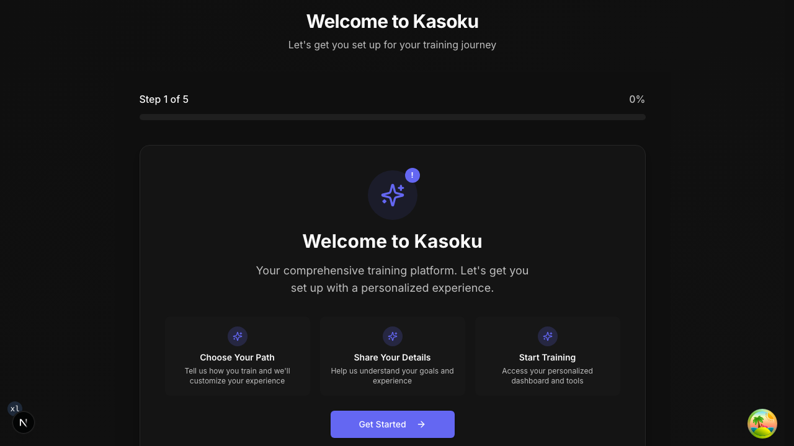
*01 — Welcome splash*

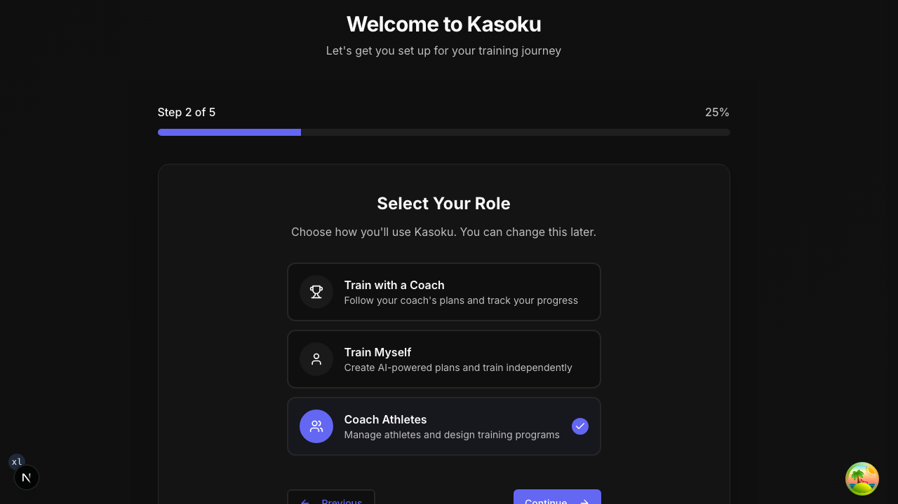
*02 — Role selection with "Coach Athletes" highlighted*

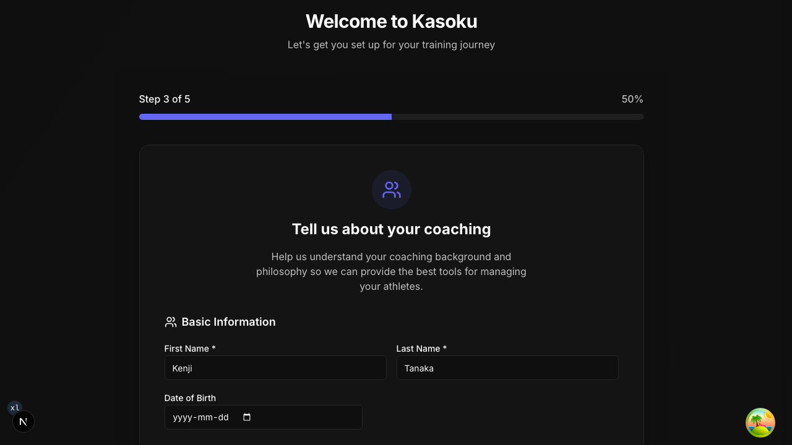
*03 — Filled coach details form*

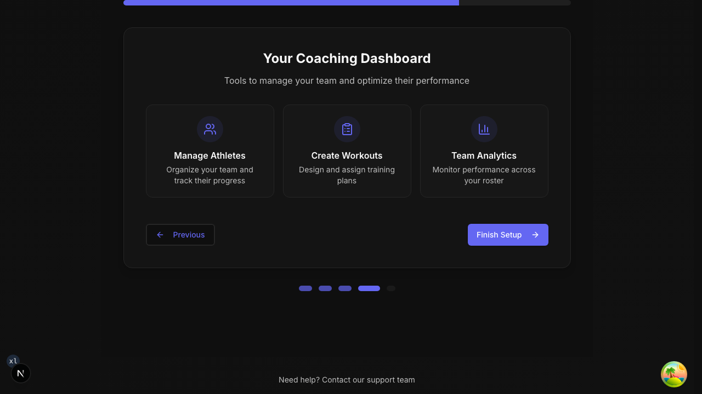
*04 — Dashboard tour (coach variant)*

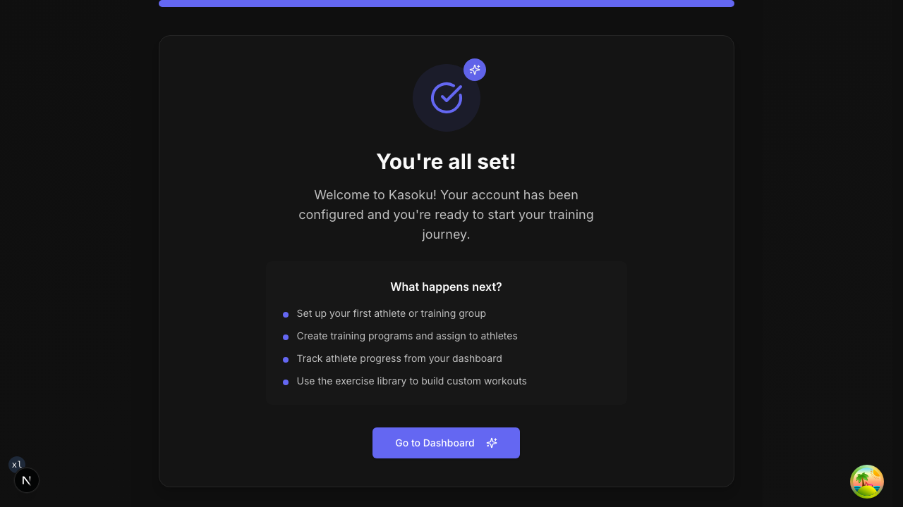
*05 — Completion "what happens next"*

---

### Stage 3: Dashboard First Impression

**Steps**:
1. Observe the empty dashboard as a new coach
2. Check sidebar navigation links
3. Note what's clickable, what's zero-state

**Functional checks**:
- [ ] Dashboard loads without errors
- [ ] Sidebar shows all coach links: Overview, Athletes, Plans, Templates, Workout, Performance, Library, Knowledge Base, Settings
- [ ] Week stats show zeros (not errors)
- [ ] "No active plans. Create one" link works → navigates to `/plans/new`

**UX checks**:
- [ ] **Empty state clarity**: When Coach Tanaka lands here with zero athletes, zero plans, zero sessions — is it obvious what to do first? Or does it feel like a dead end?
- [ ] **Navigation discovery**: Are the sidebar links self-explanatory? Would Coach Tanaka know that "Athletes" is where you create groups?
- [ ] **Information hierarchy**: Is "This Week" stats section useful when there's nothing to show? Or just confusing zeros?
- [ ] **Call to action**: Is there a clear primary CTA? The "Create one" link in Active Plans is small and easy to miss.
- [ ] **Mobile**: Does the empty dashboard work on mobile? Sidebar collapse?

**Screenshots** (critical):

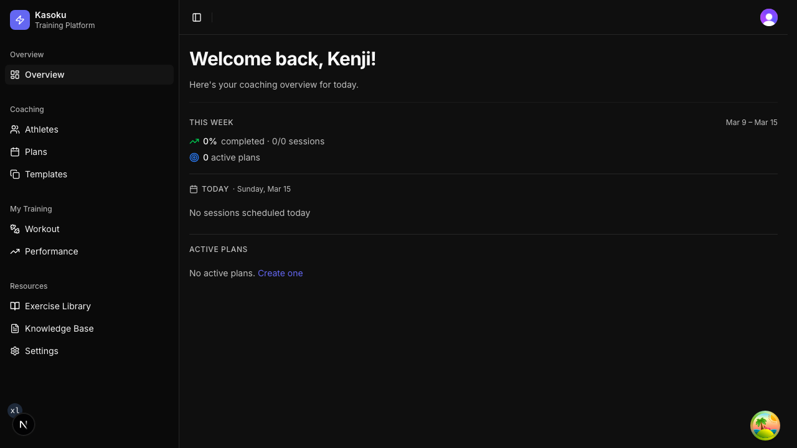
*06 — First-time empty coach dashboard*

---

### Stage 4: Group Creation

**Steps**:
1. Navigate to `/athletes` via sidebar
2. Observe empty state
3. Create first group: "Sprint Squad"
4. Create second group: "Distance Crew"
5. Verify groups appear in the group directory

**Functional checks**:
- [ ] `/athletes` loads (coach-only route guard)
- [ ] Empty state renders (no athletes, no groups)
- [ ] Group creation succeeds → appears in directory
- [ ] Group rename works (rename "Distance Crew" → "Distance Group")
- [ ] Group delete works (delete "Distance Group", verify confirmation dialog)
- [ ] Verify `athlete_groups` rows in Supabase

**UX checks**:
- [ ] **Empty state**: Does the athletes page guide Coach Tanaka to create a group first? Or is the "add group" affordance hidden?
- [ ] **Create flow**: Is the inline group name input obvious? Does it feel like a form or a button?
- [ ] **Feedback**: After creating a group, is there clear confirmation? Does the group appear immediately (optimistic update)?
- [ ] **Discoverability**: Would Coach Tanaka understand the difference between "groups" and "subgroups" without explanation?

**Screenshots** (critical):

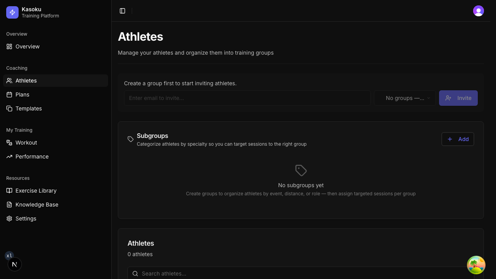
*08 — Empty athletes page*

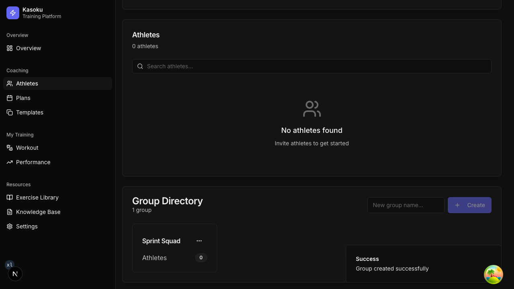
*09 — After creating "Sprint Squad" group*

---

### Stage 5: Subgroup Creation & Athlete Assignment

**Steps**:
1. Find the Subgroup Manager section on `/athletes`
2. Create subgroups: "SS" (Short Sprints), "LS" (Long Sprints), "HU" (Hurdles)
3. Invite/add a test athlete to "Sprint Squad" group
4. Assign subgroups to the athlete via SubgroupDialog
5. Verify subgroup badges appear on the athlete card

**Functional checks**:
- [ ] Subgroup creation: abbreviation max 3 chars, auto-uppercase
- [ ] Duplicate abbreviation rejected with clear error
- [ ] Athlete invite/add flow works
- [ ] SubgroupDialog opens, shows all available subgroups
- [ ] Subgroup assignment saves and persists
- [ ] Verify `subgroups` table and `athletes.subgroups` array in Supabase
- [ ] Subgroup delete shows orphan count warning

**UX checks**:
- [ ] **Subgroup Manager**: Is it obvious what a "subgroup" is? Is the abbreviation/name relationship clear?
- [ ] **Assignment flow**: Can Coach Tanaka easily assign an athlete to subgroups? Is the multi-select intuitive?
- [ ] **Visual feedback**: Do SubgroupBadge chips on athlete cards make the assignment visible at a glance?
- [ ] **Relationship clarity**: Is it clear that groups and subgroups are independent concepts (groups = team org, subgroups = event specialization)?

**Screenshots** (critical):

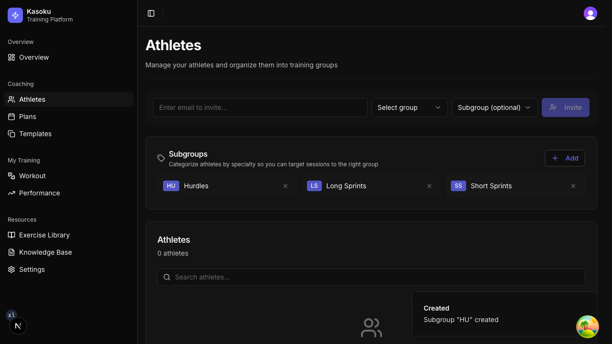
*11 — Subgroup manager with SS, LS, HU created*

---

### Stage 6: Exercise Library

**Steps**:
1. Navigate to `/library` via sidebar
2. Browse global exercises — filter by type (Sprint)
3. Create a custom exercise: "A-Skip Drill" (type: Drill, unit: Distance/m)
4. Verify it appears in "My Exercises" filter
5. Edit the exercise description
6. Verify the exercise shows up in search later (Stage 7/9)

**Functional checks**:
- [ ] Library loads with global exercises
- [ ] Type filter works (Sprint, Gym, Drill, etc.)
- [ ] Custom exercise creation succeeds
- [ ] "My Exercises" toggle filters correctly
- [ ] Edit/delete work for own exercises
- [ ] Cannot edit/delete global exercises
- [ ] Sprint exercises (type 6) show disabled edit/delete
- [ ] Pagination works when scrolling past 12 items

**UX checks**:
- [ ] **Discovery**: Does Coach Tanaka realize the library has pre-loaded exercises? Or does the page feel empty?
- [ ] **Create flow**: Is the "New Exercise" button prominent? Is the form straightforward?
- [ ] **Types/Units**: Are exercise type and unit selections obvious? Are there enough options for a sprint coach?
- [ ] **Search**: Can Coach Tanaka quickly find "100m" or "Bench Press" by typing?
- [ ] **Relationship to templates**: Is it clear that the library feeds into templates and session planning?

**Screenshots**:

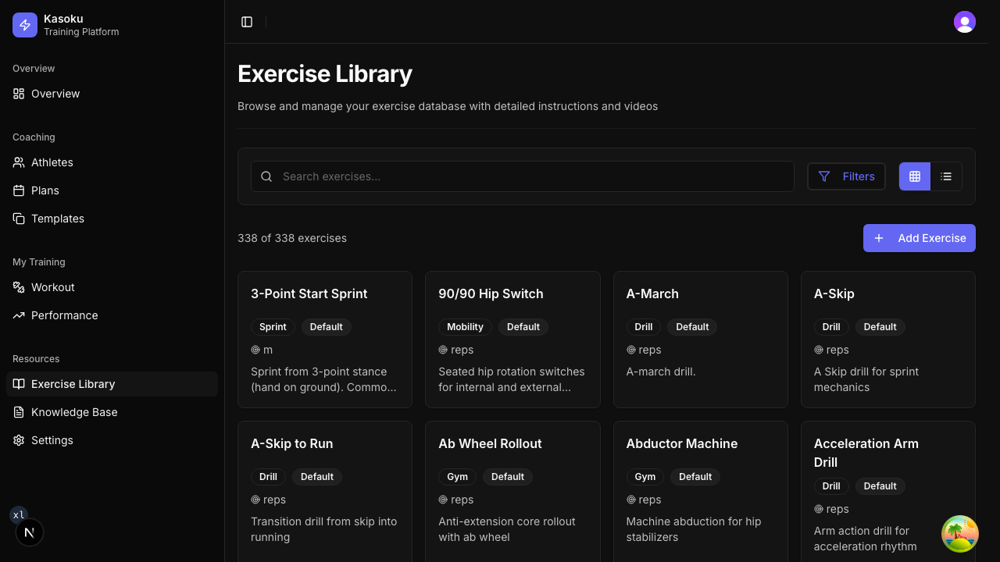
*14 — Exercise library with type filter active*

---

### Stage 7: Template Creation via AI Parser

**Steps**:
1. Navigate to `/templates` via sidebar
2. Click "New Template"
3. Click "AI Parse" / "Paste Program" in the template sheet
4. Paste a sample sprint training program:
   ```
   Warm Up:
   800m easy jog
   Dynamic stretches 10 min
   A-Skip 3x30m
   B-Skip 3x30m

   Speed Work:
   100m @ 90% x 4 (rest 6 min)
   60m flying start x 3 (rest 5 min)
   150m @ 85% x 3 (rest 8 min)

   Cool Down:
   400m easy jog
   Static stretches 15 min
   ```
5. Review AI-parsed preview — check exercise names, types, sets
6. Edit any misparses in preview
7. Confirm resolution (matched vs created exercises)
8. Save sections as templates if offered
9. Verify template appears in template list

**Functional checks**:
- [ ] PasteProgramDialog opens from template sheet
- [ ] AI parse returns structured exercises (not error)
- [ ] Preview shows exercises grouped by section
- [ ] Exercise names match library where possible
- [ ] New exercises auto-created with correct types
- [ ] Sprint exercises (100m, 60m, 150m) match from global library (not auto-created)
- [ ] Template saved with all exercises and sets
- [ ] Section-to-template promotion works (Warm Up, Cool Down auto-checked)
- [ ] Template appears in list with correct exercise count

**UX checks**:
- [ ] **Paste flow**: Is it clear what format to paste? Is the textarea large enough?
- [ ] **AI accuracy**: Does the parser handle sprint-specific notation (distances, percentages, rest intervals)?
- [ ] **Preview editing**: Can Coach Tanaka easily fix an exercise name or remove a bad parse?
- [ ] **Resolution clarity**: Is "matched" vs "created" clear? Does Coach Tanaka understand what happened?
- [ ] **Template naming**: Is the auto-generated template name useful, or generic?
- [ ] **Error handling**: What happens if the paste is gibberish? Is the error helpful?

**Screenshots** (critical):

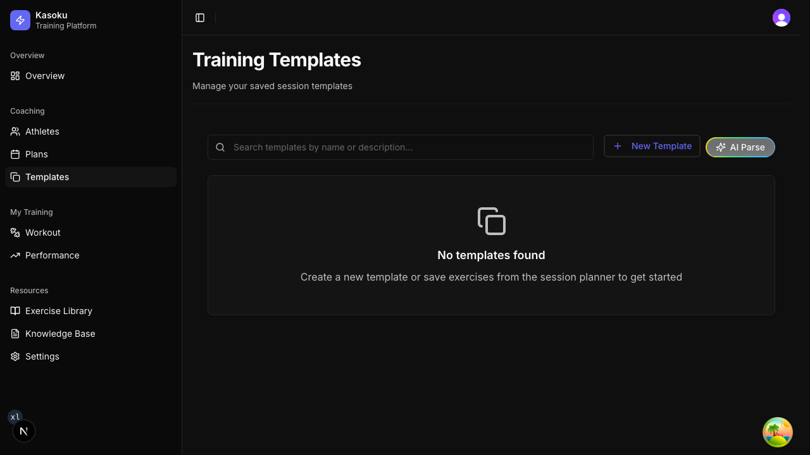
*16 — New template sheet*

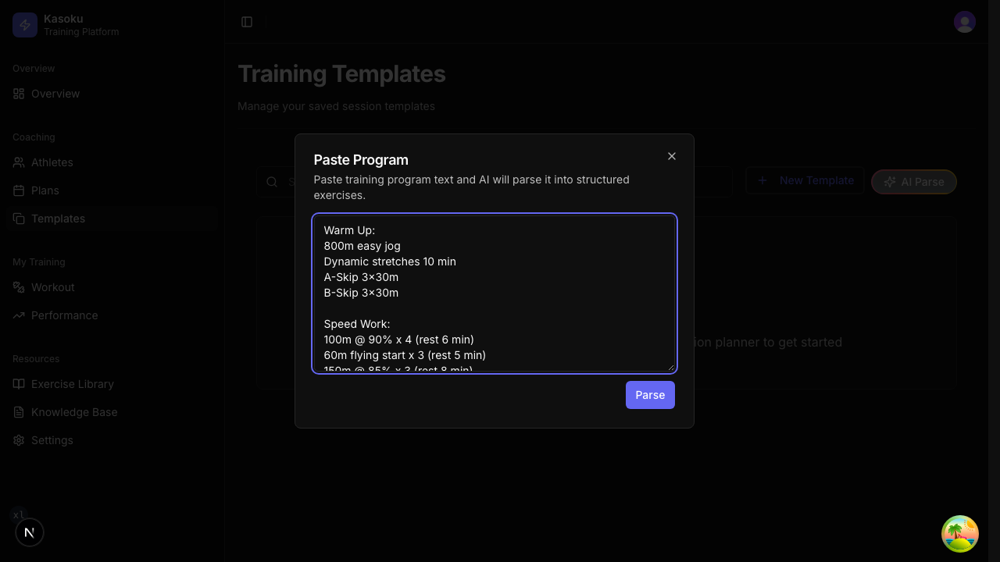
*17 — PasteProgramDialog with pasted text*


*18 — AI-parsed exercise preview (the money shot)*

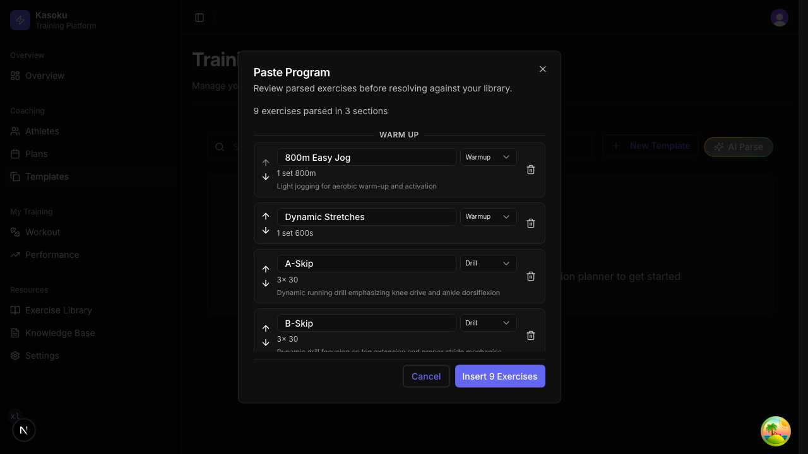
*18b — AI parse speed*

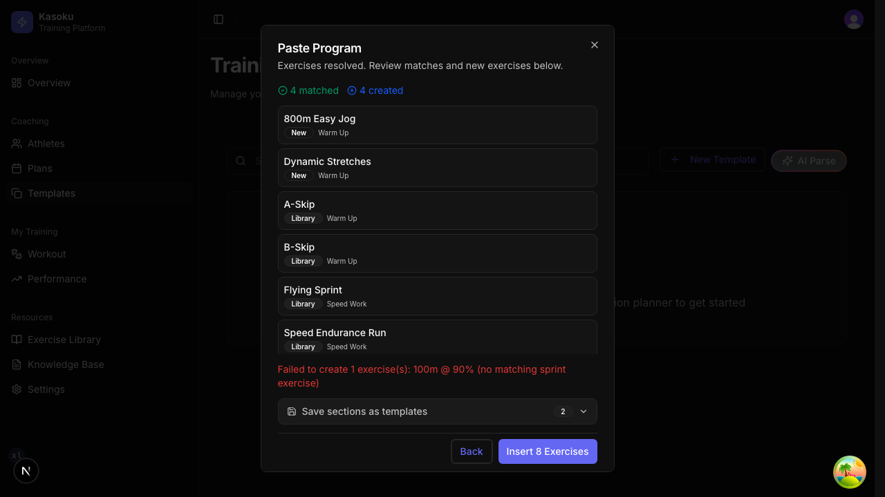
*19 — Resolution summary (matched/created)*

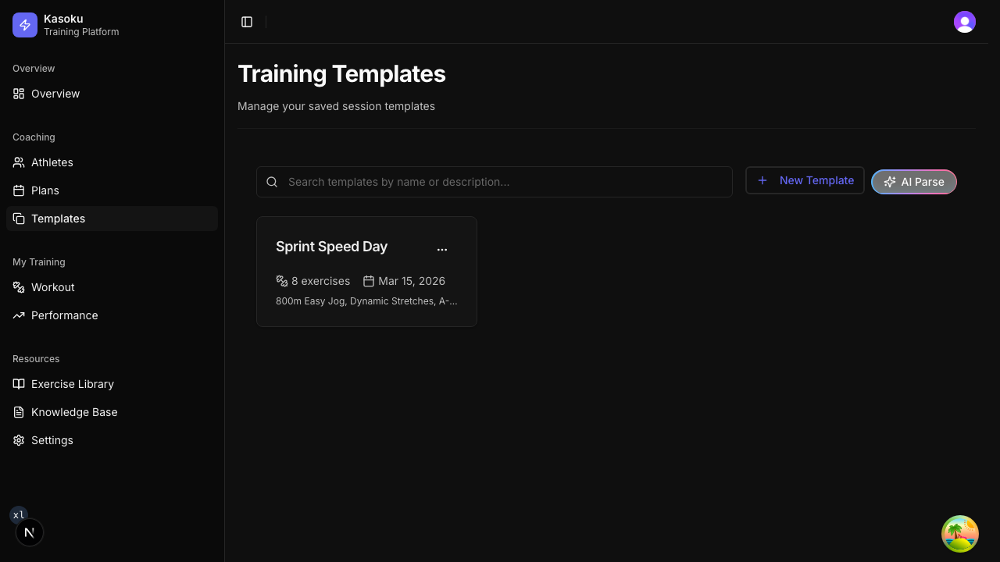
*20 — Saved template in template list*

---

### Stage 8: Season Plan Creation

**Steps**:
1. Navigate to `/plans` via sidebar
2. Click "New Plan" → CoachSeasonWizard opens
3. Fill season details:
   - Name: "Outdoor Season 2026"
   - Start: 2026-04-01
   - End: 2026-08-31
   - Planning context: (brief text about sprint-focused outdoor season)
4. Review auto-generated phase breakdown (GPP/SPP/Competition/Taper)
5. Submit → macrocycle created with mesocycles
6. Navigate into the plan workspace
7. In workspace: verify mesocycle tabs, add a microcycle (week)
8. In microcycle: add session plans for the week (Mon speed, Wed strength, Fri speed)
9. Assign the plan to "Sprint Squad" group

**Functional checks**:
- [ ] CoachSeasonWizard opens and collects all fields
- [ ] Date validation works (end > start)
- [ ] Phase auto-generation produces reasonable breakdown
- [ ] Macrocycle + mesocycles created in DB (verify via MCP)
- [ ] Workspace loads with mesocycle tabs
- [ ] Microcycle creation works within date bounds
- [ ] Session plan creation works (day, name, mode)
- [ ] Plan assignment to athlete group succeeds
- [ ] Subgroup filter bar appears with coach's subgroups (SS, LS, HU)

**UX checks**:
- [ ] **Wizard clarity**: Does Coach Tanaka understand what a "season" / "macrocycle" is? Or is the terminology intimidating?
- [ ] **Date picking**: Is the start/end date selection intuitive?
- [ ] **Phase breakdown**: Is the auto-generated phase split understandable? Can Coach Tanaka adjust it?
- [ ] **Workspace navigation**: Once in the plan, can Coach Tanaka figure out how to add weeks and sessions? Or is the hierarchy confusing (meso → micro → session)?
- [ ] **Empty workspace**: When the workspace opens with zero microcycles, is it clear how to start adding weeks?
- [ ] **Group assignment**: Is it obvious how to connect a plan to a group?
- [ ] **Three-panel drill-down (mobile)**: Does the meso → micro → session navigation work on mobile?

**Screenshots** (critical):

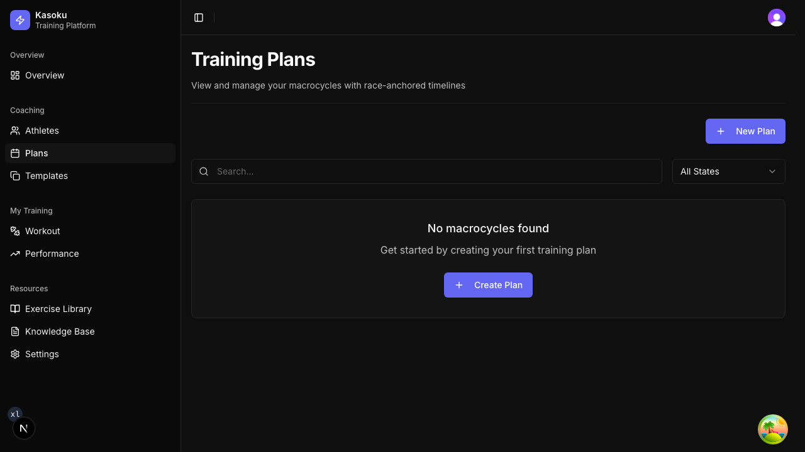
*21 — Empty plans page*

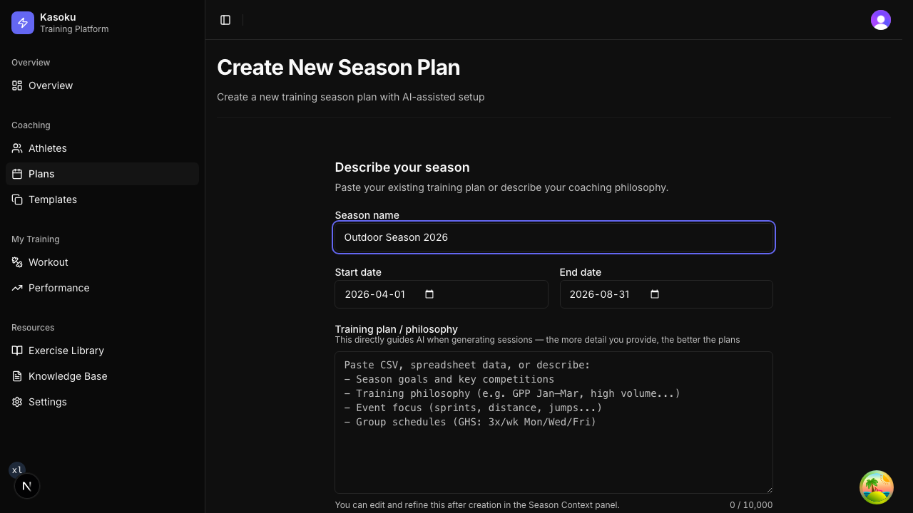
*22 — CoachSeasonWizard form*

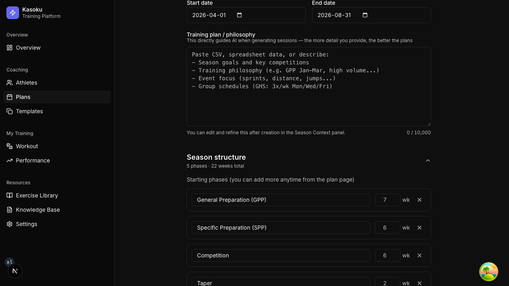
*23 — Auto-generated phase breakdown*

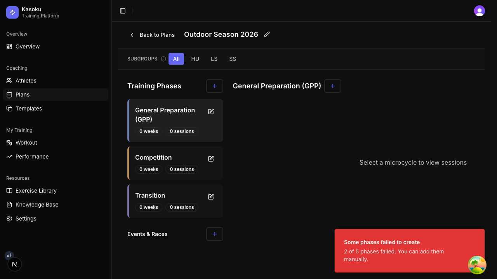
*24 — Plan workspace with mesocycle tabs*

---

### Stage 9: Session Editing & AI Assistant

**Steps**:
1. From the plan workspace, click into a session plan (e.g., "Monday Speed")
2. SessionPlannerV2 opens
3. Add exercises manually via ExercisePickerSheet (search for "100m")
4. Configure sets (4x100m with rest times)
5. Use "Paste Program" from More menu to bulk-add exercises
6. Use AI assistant (chat) to request a modification: "increase all sprint distances by 10%"
7. Review AI inline proposal (diff view)
8. Approve the proposal
9. Assign target subgroups to specific exercises
10. Save the session

**Functional checks**:
- [ ] Session planner loads with session metadata
- [ ] ExercisePickerSheet opens, search returns results
- [ ] Exercise added to session with empty set
- [ ] Set fields render correctly for exercise type (sprint shows distance, time, rest)
- [ ] PasteProgramDialog works from within session planner
- [ ] AI chat sends message, receives response
- [ ] AI proposal renders inline with diff (old → new values)
- [ ] Approve applies changes to exercise list
- [ ] Target subgroup assignment per-exercise works
- [ ] Save persists all changes to DB
- [ ] Undo/redo works after mutations
- [ ] Back button shows "Discard changes?" when unsaved

**UX checks**:
- [ ] **Exercise search**: Is the ExercisePickerSheet easy to use? Can Coach Tanaka find exercises quickly?
- [ ] **Set configuration**: Are the right fields visible for sprint exercises? Is the layout clear?
- [ ] **AI assistant**: Is the chat button discoverable? Does Coach Tanaka understand they can talk to an AI?
- [ ] **AI proposals**: Is the inline diff clear? Does "approve" vs "dismiss" make sense?
- [ ] **Subgroup targeting**: Can Coach Tanaka understand that tagging exercises with subgroups means only those athletes see them?
- [ ] **Save clarity**: Is the unsaved changes indicator visible enough? Does Coach Tanaka feel confident their work is saved?
- [ ] **Information density**: With exercises, sets, subgroups, supersets, and AI proposals — is the screen overwhelming?

**Screenshots** (critical):
*(Stage 9 was not fully executed during the initial E2E run — screenshots pending for future runs)*

---

## Onboarding Review & Improvements

### Current State Analysis

**Step 3 (Dashboard Tour) — Coach variant**:
- Shows 3 cards: "Manage Athletes", "Create Workouts", "Team Analytics"
- **Problem**: Too generic. These are feature categories, not actionable steps. A coach already knows a coaching platform has these things.
- **Missing**: No mention of groups, subgroups, exercise library, templates, AI parser, or the season wizard.

**Step 4 (Completion) — Coach "What happens next"**:
- 4 bullets: set up athlete/group, create programs, track progress, use exercise library
- **Problem**: Unordered list when the steps are actually sequential. "Create training programs" skips prerequisite steps. "Exercise library" is listed last but should logically come earlier.
- **Missing**: AI parser mention, template creation, season planning concept.

### Proposed Improvements

**Step 3 — Replace generic cards with a numbered quick-start sequence**:

Keep it to 3-4 steps max to avoid information overload. Each step should answer "where do I go?" and "what do I do there?":

1. **Set Up Your Team** (Users icon) → "Go to Athletes to create training groups and invite your athletes"
2. **Build Your Exercise Library** (Dumbbell icon) → "Paste your training program and our AI will parse it into reusable templates"
3. **Plan Your Season** (Calendar icon) → "Create a season plan, set phases, and assign sessions to your groups"

Drop "Team Analytics" — it's a consequence, not a setup step. Replace with something actionable.

**Step 4 — Replace unordered bullets with a numbered sequence**:

1. Head to **Athletes** to create your first training group
2. Create **subgroups** for event specializations (e.g., Short Sprints, Hurdles)
3. Visit **Templates** and paste a training program — AI will parse it for you
4. Go to **Plans** to set up your season and assign workouts

Keep the existing visual design (bullet points in a card). Just reorder and reword for sequential clarity.

**Constraint**: Don't add more than 4 items. Don't add links (they'd break the onboarding flow). Keep it scannable — Coach Tanaka should read this in 10 seconds.

---

## Walkthrough Page Spec: /demo/coach

### Route

`apps/web/app/(marketing)/demo/coach/page.tsx` — public, no auth required.

### Purpose

A visual, step-by-step guide showing coaches what the platform looks like and how to get started. Serves two audiences:
1. **Prospects**: "Should I sign up?" → See the workflow before committing
2. **New coaches**: "I just onboarded, now what?" → Reference guide for the first session

### Page Structure

```
Hero Section
  - Headline: "Your First Day as a Kasoku Coach"
  - Subtext: "From signup to your first training plan in 15 minutes"
  - CTA: "Start Free" → /sign-up

Step-by-Step Walkthrough (scrollable sections)
  Each section:
  - Step number + title
  - 1-2 sentence description
  - Screenshot(s) with optional caption
  - "Coach tip" callout (optional, for non-obvious features)

  Sections:
  1. "Create Your Account" — onboarding screenshots (role select, details)
  2. "Set Up Your Team" — groups + subgroups creation
  3. "Build Your Exercise Library" — library browse, custom exercise
  4. "Import a Training Program" — AI parser flow (the hero feature)
  5. "Plan Your Season" — season wizard, phase breakdown
  6. "Design Your Sessions" — session planner, exercise picker
  7. "Let AI Assist You" — AI chat + inline proposals
  8. "Track & Adjust" — dashboard with data, subgroup filtering

CTA Section
  - "Ready to start?" → /sign-up
  - "Questions?" → contact/book-a-call link
```

### Design Guidelines

- Use the existing `(marketing)` layout (LandingHeader + Footer + Lenis scroll)
- Match the visual style of the existing `/demo` page (Framer Motion, dark theme, gradient accents)
- Screenshots displayed in browser/phone frame mockups (like the existing demo page's approach)
- Responsive: single column on mobile, image+text side-by-side on desktop
- Alternate image position (left/right) per section for visual rhythm
- Keep text minimal — the screenshots tell the story

### Technical Implementation

- Server Component (no interactivity needed beyond scroll)
- Images served from `public/demo/coach/` (optimized PNGs via `next/image`)
- Framer Motion for scroll-triggered fade-in animations (consistent with `/demo` page)
- No database calls, no auth requirement

---

## Execution Checklist

### Phase 1: Test Infrastructure Setup
- [ ] Decide: use existing test coach user OR create fresh account
- [ ] If fresh: create Clerk user via API, note user_id
- [ ] Generate sign-in token
- [ ] Verify agent-browser session works with auth
- [ ] Create screenshot output directory `apps/web/public/demo/coach/`

### Phase 2: E2E Test Execution (Stages 1-9)
- [ ] Stage 1: Account creation & auth
- [ ] Stage 2: Onboarding wizard (5 screenshots)
- [ ] Stage 3: Dashboard first impression (2 screenshots)
- [ ] Stage 4: Group creation (3 screenshots)
- [ ] Stage 5: Subgroup creation & athlete assignment (3 screenshots)
- [ ] Stage 6: Exercise library (2 screenshots)
- [ ] Stage 7: Template creation via AI parser (5 screenshots)
- [ ] Stage 8: Season plan creation (6 screenshots)
- [ ] Stage 9: Session editing & AI assistant (6 screenshots)
- [ ] Total: ~32 screenshots

### Phase 3: UX Review Document
- [ ] Write UX findings per stage (coach persona perspective)
- [ ] Prioritize issues: P0 (blocks coach), P1 (confusing), P2 (polish)
- [ ] Include specific improvement suggestions with before/after

### Phase 4: Onboarding Improvements
- [ ] Update `dashboard-tour-step.tsx` — coach feature cards
- [ ] Update `completion-step.tsx` — coach next steps bullets
- [ ] Verify changes render correctly
- [ ] Screenshot updated onboarding steps

### Phase 5: Walkthrough Page Build
- [ ] Create `apps/web/app/(marketing)/demo/coach/page.tsx`
- [ ] Implement all 8 sections with screenshots
- [ ] Add Framer Motion scroll animations
- [ ] Responsive layout (mobile + desktop)
- [ ] Test with `npm run build:web` — no type errors
- [ ] Visual review via agent-browser

### Phase 6: Final Verification
- [ ] Run full E2E again with updated onboarding
- [ ] Verify `/demo/coach` renders correctly (public, no auth)
- [ ] `git diff --stat` — only expected files changed
- [ ] Screenshot the walkthrough page itself for review

---

## Appendix: Sample AI Parse Input

Use this for Stage 7 testing:

```
Warm Up:
800m easy jog
Dynamic stretches 10 min
A-Skip 3x30m
B-Skip 3x30m
High Knees 3x30m

Main Set - Short Sprints (SS):
Block starts 6x30m (full recovery)
100m @ 90% x 4 (rest 6 min)
60m flying start x 3 (rest 5 min)

Main Set - Long Sprints (LS):
150m @ 85% x 3 (rest 8 min)
200m @ 80% x 2 (rest 10 min)

Strength:
Squat 4x6 @ 80% 1RM
Romanian Deadlift 3x8 @ 70%
Single Leg Hip Thrust 3x10 each

Cool Down:
400m easy jog
Static stretches 15 min
Foam rolling 10 min
```

## Appendix: Key Files Reference

| Area | File |
|------|------|
| Onboarding wizard | `apps/web/components/features/onboarding/onboarding-wizard.tsx` |
| Dashboard tour (step 3) | `apps/web/components/features/onboarding/steps/dashboard-tour-step.tsx` |
| Completion (step 4) | `apps/web/components/features/onboarding/steps/completion-step.tsx` |
| Coach dashboard | `apps/web/components/features/dashboard/components/coach-dashboard-view.tsx` |
| Sidebar nav | `apps/web/components/layout/sidebar/app-sidebar.tsx` |
| Athlete/group management | `apps/web/components/features/athletes/components/lean-athlete-management-page.tsx` |
| Group directory | `apps/web/components/features/athletes/components/group-directory-section.tsx` |
| Subgroup manager | `apps/web/components/features/athletes/components/subgroup-manager.tsx` |
| Subgroup dialog | `apps/web/components/features/athletes/components/subgroup-dialog.tsx` |
| Exercise library | `apps/web/components/features/exercise/components/exercise-library-page.tsx` |
| Templates page | `apps/web/components/features/plans/components/templates-page.tsx` |
| AI parser dialog | `apps/web/components/features/training/components/PasteProgramDialog.tsx` |
| Season wizard | `apps/web/components/features/plans/coach-wizard/CoachSeasonWizard.tsx` |
| Plan workspace | `apps/web/components/features/plans/workspace/TrainingPlanWorkspace.tsx` |
| Session planner | `apps/web/components/features/training/views/SessionPlannerV2.tsx` |
| Exercise picker | `apps/web/components/features/training/components/ExercisePickerSheet.tsx` |
| AI session assistant | `apps/web/components/features/ai-assistant/SessionAssistant.tsx` |
| Existing demo page | `apps/web/app/(marketing)/demo/page.tsx` |
| Group actions | `apps/web/actions/athletes/athlete-actions.ts` |
| Subgroup actions | `apps/web/actions/athletes/subgroup-actions.ts` |
| Exercise actions | `apps/web/actions/library/exercise-actions.ts` |
| Template/plan actions | `apps/web/actions/plans/session-plan-actions.ts` |
| Plan actions | `apps/web/actions/plans/plan-actions.ts` |
| AI parse action | `apps/web/actions/plans/ai-parse-session-action.ts` |
