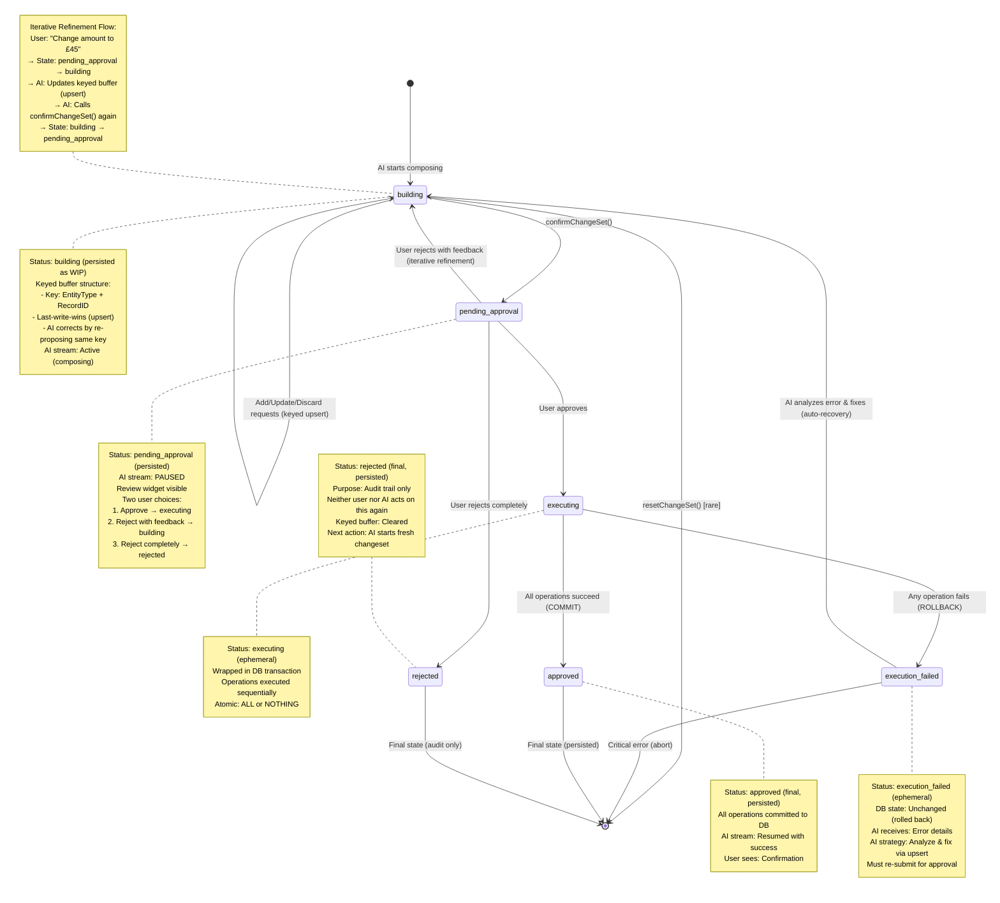
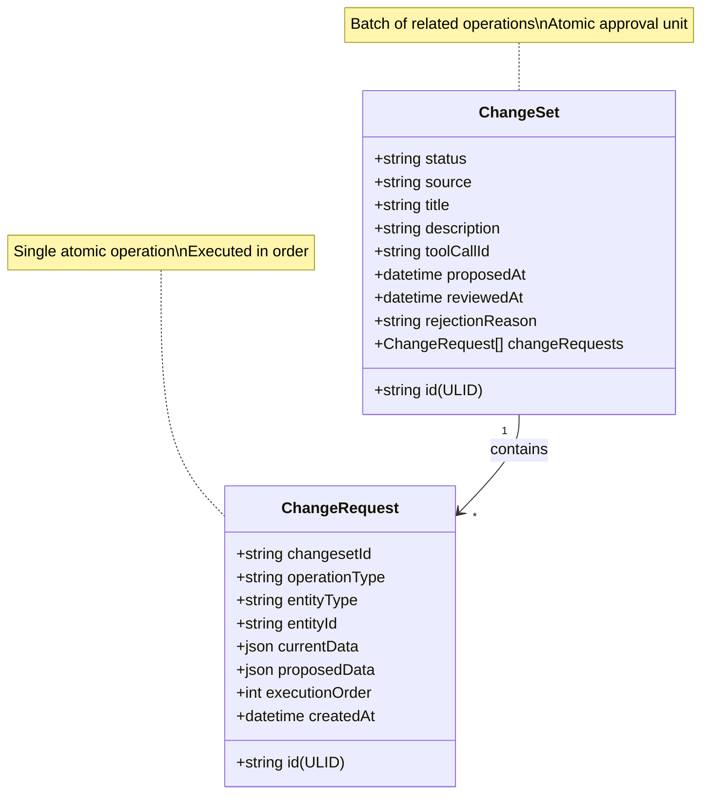
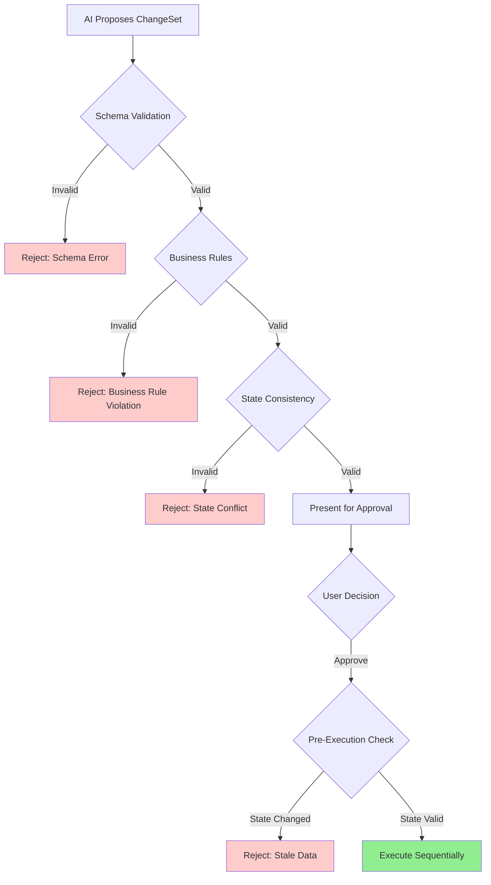
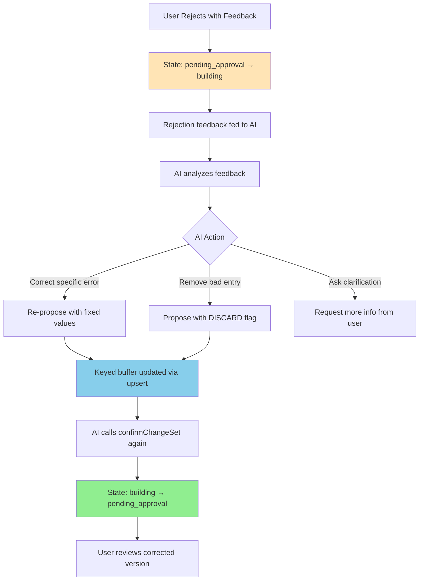
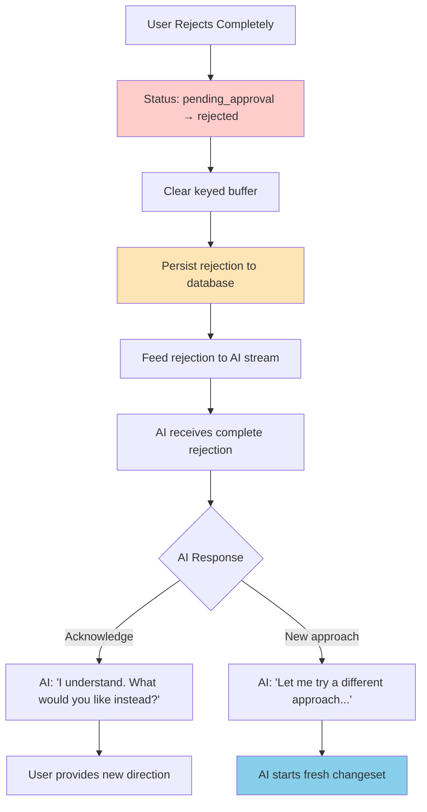
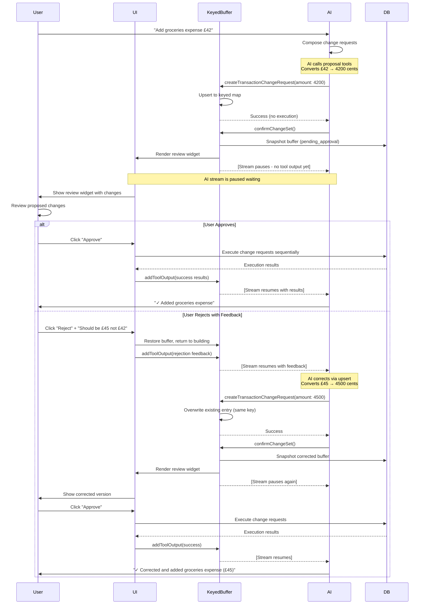
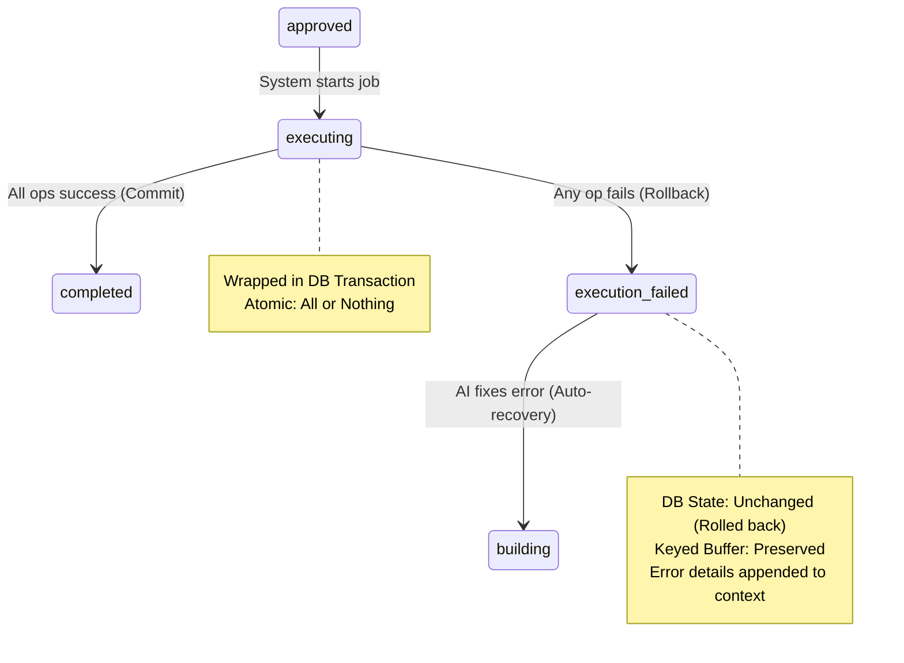
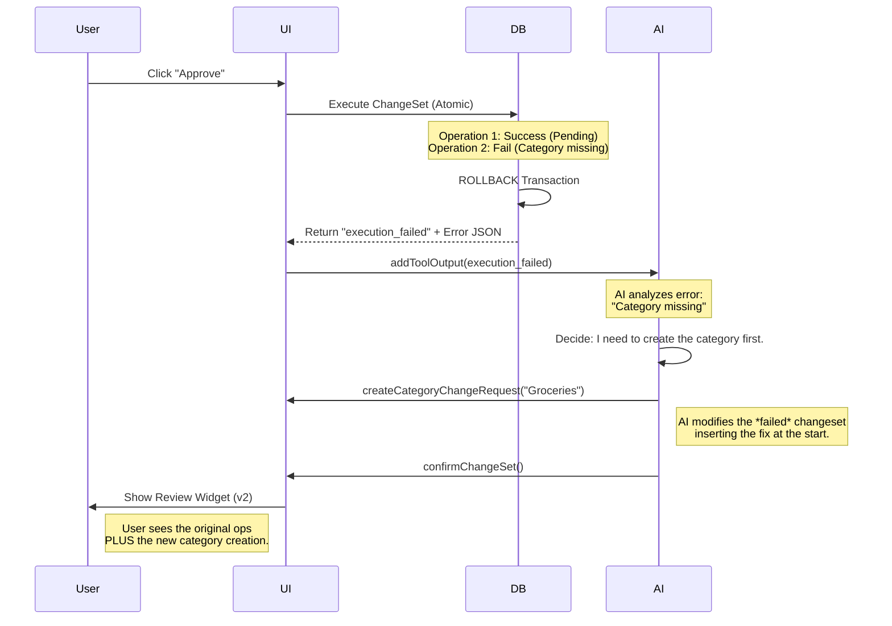

# SAD Section 4: The ChangeSet Domain Logic

**Project:** OurPot - Household Kitty Expense Tracker
**Version:** v1.0 (Local-Only)
**Date:** 2025-12-18
**Status:** Living Document

---

## 4.1 The Proposal State Machine

### Complete State Lifecycle (Unified Diagram)



### State Definitions

| State | Description | AI Stream | User Visibility | Persistence |
|-------|-------------|-----------|-----------------|-------------|
| **building** | AI is accumulating/correcting change requests in keyed buffer | Active (composing) | Hidden | Persisted as WIP |
| **pending_approval** | Awaiting user review | Paused (blocked) | Review widget visible | Persisted as pending |
| **executing** | Operations being applied in DB transaction | Paused | Loading indicator | Ephemeral (transitions quickly) |
| **approved** | User accepted and operations successfully applied | Resumed | Confirmation shown | Persisted permanently (final state) |
| **execution_failed** | Execution encountered error and rolled back | Resumed with error | Error message shown | Ephemeral (AI auto-corrects) |
| **rejected** | User completely rejected (not iterative correction) | Resumed | Rejection shown | Persisted for audit only |

**Terminology Note:**
- **approved**: Final persisted status in database indicating successful completion
- **completed**: Used conversationally in text but maps to `approved` status in schema
- **executing/execution_failed**: Internal transient states during atomic execution, may not be persisted to database

### State Transitions

**building → pending_approval:**
- Trigger: AI calls `confirmChangeSet()` tool
- Precondition: At least one change request exists in buffer
- Action: Snapshot keyed buffer to database, display review widget
- Effect: AI stream pauses waiting for approval

**pending_approval → approved:**
- Trigger: User clicks "Approve" button
- Action: Execute change requests sequentially, update status to "approved"
- Effect: Operations applied to database, AI stream resumes with success results

**pending_approval → building (iterative correction):**
- Trigger: User clicks "Reject with feedback" button (e.g., "Change amount to £45.00")
- Action: Rejection feedback fed back to AI stream, restore keyed buffer
- Effect: State reverts to building, AI receives feedback, corrects errors by re-proposing

**pending_approval → rejected (complete rejection):**
- Trigger: User clicks "Reject completely" button or rejects without specific feedback
- Action: Update status to "rejected", clear keyed buffer, record rejection
- Effect: AI stream resumes with complete rejection, must start fresh proposal

**building → [reset]:**
- Trigger: AI calls `resetChangeSet()` tool (rare, error recovery)
- Action: Clear keyed buffer entirely
- Effect: AI starts fresh changeset from scratch

---

## 4.2 ChangeSet Payload Structure

### The Keyed Buffer Architecture

**Core Concept:** The building phase uses a **Key-Value Map** (not an array) to accumulate change requests.

**The Key:** Composite identifier = `EntityType + RecordID`
- Example: `"transaction:01JBQU..."` or `"category:01JBQT..."`
- For creates: Temporary client-side ID used as placeholder

**The Behavior (Last-Write-Wins / Upsert):**
- When AI proposes an operation on an entity already in the buffer, the new proposal **overwrites** the previous one
- AI corrects errors by simply re-proposing with fixed values (no index management needed)
- Special `action: "DISCARD"` flag removes entries from buffer entirely

**Benefits:**
- **Idempotent:** AI can restate intent multiple times without creating duplicates
- **Zero Index Tracking:** AI doesn't manage array indices (eliminates "off-by-one" hallucinations)
- **Natural Corrections:** "Change the amount to £45.00" → AI just re-calls tool with new amount (converts £45.00 to 4500 cents)

### Hierarchical Model



### ChangeSet Structure

**Purpose:** Container for a batch of related operations proposed by AI.

**Fields:**
- `id`: Unique identifier (ULID)
- `status`: Current state (building | pending_approval | approved | rejected)
- `source`: Origin (ai | manual | import)
- `title`: Short human-readable summary (e.g., "Add groceries expense")
- `description`: Detailed explanation of what changes are being made
- `toolCallId`: AI tool call ID for stream synchronization (nullable)
- `proposedAt`: Timestamp when changeset was created
- `reviewedAt`: Timestamp when user approved/rejected (nullable)
- `rejectionReason`: User-provided reason for rejection (nullable)

### ChangeRequest Structure

**Purpose:** Single atomic operation within a changeset.

**Fields:**
- `id`: Unique identifier (ULID)
- `changesetId`: Parent changeset ID
- `operationType`: create | update | delete
- `entityType`: transaction | category | account | member
- `entityId`: Target entity ID (null for creates)
- `currentData`: JSON snapshot of current state (auto-populated)
- `proposedData`: JSON of proposed changes (AI-generated)
- `executionOrder`: Sequence number (0, 1, 2...) for deterministic execution
- `createdAt`: Timestamp when request was created

### Operation Type Semantics

#### Create Operation

**Purpose:** Insert new entity into database.

**Structure:**
```json
{
  "operationType": "create",
  "entityType": "transaction",
  "entityId": null,
  "currentData": null,
  "proposedData": {
    "accountId": "01JBQR...",
    "memberId": "01JBQS...",
    "categoryId": "01JBQT...",
    "type": "EXPENSE",
    "amount": 4200,
    "merchant": "Whole Foods",
    "description": "Weekly groceries",
    "date": "2025-12-18T10:30:00Z"
  }
}
```
*Note: amount is 4200 (cents) = £42.00*

**Validation Rules:**
- `currentData` must be null
- `proposedData` must contain all required fields for entity
- Referenced entities (accountId, memberId, categoryId) must exist

#### Update Operation

**Purpose:** Modify existing entity.

**Structure:**
```json
{
  "operationType": "update",
  "entityType": "transaction",
  "entityId": "01JBQU...",
  "currentData": {
    "amount": 4200,
    "merchant": "Whole Foods",
    "description": "Weekly groceries"
  },
  "proposedData": {
    "amount": 4500,
    "merchant": "Whole Foods Market",
    "description": "Weekly groceries (updated with extra items)"
  }
}
```
*Note: amounts in cents (4200 = £42.00, 4500 = £45.00)*

**Validation Rules:**
- `entityId` must reference existing entity
- `currentData` automatically populated from database before approval
- `proposedData` contains only fields being changed (partial update)
- Current state verified before execution (optimistic concurrency check)

#### Delete Operation

**Purpose:** Soft-delete existing entity.

**Structure:**
```json
{
  "operationType": "delete",
  "entityType": "transaction",
  "entityId": "01JBQU...",
  "currentData": {
    "accountId": "01JBQR...",
    "amount": 4200,
    "merchant": "Whole Foods",
    "description": "Weekly groceries",
    "date": "2025-12-18T10:30:00Z"
  },
  "proposedData": null
}
```
*Note: amount is 4200 (cents) = £42.00*

**Validation Rules:**
- `entityId` must reference existing entity
- `currentData` shown for user review (transparency)
- `proposedData` must be null
- Execution sets `deletedAt` timestamp (soft delete)

---

## 4.3 Draft Validation (Business Rules & State Consistency)

### Validation Layers



### Validation Stages

#### Stage 1: Schema Validation (Client-Side)

**Purpose:** Ensure ChangeRequest structure is well-formed.

**Checks:**
- All required fields present
- Field types correct (string, number, boolean)
- Enum values valid (operationType, entityType)
- JSON in currentData/proposedData parseable

**Timing:** When change request is added to building changeset

**Failure Handling:** AI receives error, can retry with corrected data

#### Stage 2: Business Rules Validation (Client-Side)

**Purpose:** Enforce domain-specific constraints.

**Example Rules:**

**Transaction Rules:**
- `amount` must be positive integer (representing cents/pence)
- `date` cannot be in future
- `categoryId` required for EXPENSE, optional for DEPOSIT
- `memberId` must belong to same account

**Account Rules:**
- `currency` must be valid ISO 4217 code (GBP, EUR, USD)
- `name` cannot be empty string

**Member Rules:**
- Only one member per account can have `isKitty=true`
- `role` must be "owner" or "member"

**Category Rules:**
- `name` must be unique within account
- `name` cannot be empty string

**Timing:** When change request is added or before moving to pending_approval

**Failure Handling:** AI receives specific error message, can revise proposal

#### Stage 3: State Consistency Validation (Pre-Approval)

**Purpose:** Verify operations are consistent with current database state.

**Checks:**
- Referenced entities exist (FK validation)
- Update operations target entities that haven't been deleted
- No duplicate operations on same entity
- Sequential dependencies satisfied (e.g., create account before creating transaction in that account)

**Example Conflict:**
```
ChangeRequest 1: Create category "Groceries"
ChangeRequest 2: Create transaction with categoryId="groceries-existing"
Problem: categoryId references entity not yet created
Resolution: Reorder operations or use temporary ID resolution
```

**Timing:** When transitioning from building → pending_approval

**Failure Handling:** User sees error in review widget, can reject and ask AI to fix

#### Stage 4: Pre-Execution Validation (Optimistic Concurrency)

**Purpose:** Detect if database state changed between approval and execution.

**Check:** For update/delete operations, verify `currentData` still matches database.

**Example Conflict:**
```
Approval Time: Transaction amount is 4200 (£42.00)
Execution Time: Another process changed amount to 4500 (£45.00)
Action: Abort execution, notify user of conflict
```

**Timing:** Immediately before executing each change request

**Failure Handling:** Entire changeset fails, user notified, AI can re-propose with fresh data

### Validation Error Messages

**Schema Error Example:**
```json
{
  "error": "SCHEMA_ERROR",
  "field": "proposedData.amount",
  "message": "Amount must be a positive integer (cents/pence)",
  "changeRequestIndex": 0
}
```

**Business Rule Error Example:**
```json
{
  "error": "BUSINESS_RULE_VIOLATION",
  "rule": "CATEGORY_REQUIRED_FOR_EXPENSE",
  "message": "Expense transactions must have a category",
  "changeRequestIndex": 2
}
```

**State Conflict Example:**
```json
{
  "error": "STATE_CONFLICT",
  "type": "STALE_DATA",
  "message": "Transaction was modified by another process",
  "entityId": "01JBQU...",
  "expected": {"amount": 4200},
  "actual": {"amount": 4500}
}
```
*Note: amounts in cents (4200 = £42.00, 4500 = £45.00)*

---

## 4.4 Changeset Review Workflow (Iterative Refinement vs Complete Rejection)

### Review Response Philosophy

**Principle:** Support both iterative refinement and complete rejection depending on user intent.

**Two Rejection Modes:**

1. **Iterative Correction (Reject with Feedback):**
   - User provides specific feedback ("Change amount to 45.00")
   - State returns to `building` with keyed buffer restored
   - AI corrects specific errors via upsert
   - Token efficient, conversational UX

2. **Complete Rejection (Reject & Reset):**
   - User rejects entire changeset without specific corrections
   - Status set to `rejected`, keyed buffer cleared
   - AI must start fresh proposal from scratch
   - Persisted for audit trail

**When to Use Each:**
- **Iterative Correction:** Small errors, specific fixes needed ("Wrong amount", "Remove this transaction")
- **Complete Rejection:** Fundamentally wrong approach, user wants different solution ("No, I don't want to categorize these at all")

### Correction Workflow



### The Correction Mechanism

**Step 1: Rejection Feedback**
```json
{
  "action": "reject",
  "feedback": "The amount should be £45.00, not £42.00, and don't include the second transaction"
}
```

**Step 2: State Transition**
- Status: `pending_approval` → `building`
- Keyed buffer is restored (not cleared)
- AI stream resumes with rejection feedback

**Step 3: AI Correction (Upsert)**
AI calls proposal tool with corrected values:
```javascript
createTransactionChangeRequest({
  entityId: "01JBQU...",  // Same key
  amount: 4500,           // Corrected value (£45.00 → 4500 cents)
  merchant: "Whole Foods",
  description: "Weekly groceries"
})
// System action: Overwrites existing buffer entry for "transaction:01JBQU..."
```

**Step 4: AI Removal (Discard)**
AI removes unwanted entry:
```javascript
createTransactionChangeRequest({
  entityId: "01JBQV...",  // Second transaction
  action: "DISCARD"       // Special flag
})
// System action: Removes "transaction:01JBQV..." from buffer entirely
```

**Step 5: Re-submission**
AI calls `confirmChangeSet()` again → State: `building` → `pending_approval`

### Example Interaction Flow

**Initial Proposal:**
```
AI: "I'll add two transactions: Groceries (£42) and Transport (£15)"
Buffer State: {
  "transaction:temp-001": { amount: 4200, category: "Groceries" },
  "transaction:temp-002": { amount: 1500, category: "Transport" }
}
Status: pending_approval
```
*Note: amounts stored as integers (4200 = £42.00, 1500 = £15.00)*

**User Rejects:**
```
User: "Reject. Groceries should be £45, and remove the transport entry"
Status: pending_approval → building
```

**AI Correction:**
```
AI calls:
1. createTransactionChangeRequest(temp-001, amount: 4500) // Upsert (£45.00 → 4500 cents)
2. createTransactionChangeRequest(temp-002, action: "DISCARD") // Remove

Buffer State: {
  "transaction:temp-001": { amount: 4500, category: "Groceries" }
}

AI: "I've corrected the amount to £45 and removed the transport entry. Please review."
AI calls: confirmChangeSet()
Status: building → pending_approval
```
*Note: amount 4500 = £45.00*

**User Approves:**
```
User: "Approve"
Status: pending_approval → approved
Result: Single transaction created with amount 4500 (displayed as £45.00)
```

### Benefits of Iterative Correction

**1. Natural for LLMs:**
- AI restates intent in natural language ("Change X to Y")
- No need to track array indices or manage deletion semantics
- Aligns with how LLMs naturally process corrections

**2. Token Efficient:**
- Only re-outputs corrected values, not entire changeset
- Avoids full reset + rebuild cycle

**3. Better UX:**
- Feels conversational ("Please fix this" → "Done")
- User sees incremental progress
- Less robotic than "resetting everything"

**4. Safer:**
- No risk of approving known bad states later
- Each approval decision is based on current correct state
- Prevents "revisit old rejected changeset" confusion

### Complete Rejection Workflow



**Use Cases for Complete Rejection:**

**1. Wrong Approach:**
```
AI: "I'll create 3 categories and categorize all transactions"
User: "Reject completely. I don't want categories at all, just add the transactions"
Status: rejected
AI: "Understood. I'll add the transactions without categorization."
```

**2. Misunderstood Intent:**
```
AI: "I'll delete these 10 transactions as you requested"
User: "Reject completely! I meant archive, not delete"
Status: rejected
AI: "My apologies. Let me create an archive feature instead."
```

**3. Too Complex:**
```
AI: "I'll restructure your accounts and merge 5 categories"
User: "Reject completely. That's too much change at once."
Status: rejected
AI: "Understood. What single change would you like to make first?"
```

### Audit Trail: Both Approved and Rejected

**What Gets Persisted:**
- Changesets with `status: "approved"` - permanent record of applied changes
- Changesets with `status: "rejected"` - audit trail of rejected proposals
- `reviewedAt` timestamp records when user made decision
- Optional `rejectionReason` field for complete rejections

**What Doesn't Get Persisted:**
- Intermediate building states (ephemeral, in-memory only)
- Iterative correction attempts (part of conversation flow)

**Rationale:**
- **Approved changesets:** Source of truth for what was applied
- **Rejected changesets:** Audit trail, learning data, accountability
- **Building states:** Temporary, not meaningful for history

---

## 4.5 The AI-Human Interaction Flow

### Complete Approval Workflow with Iterative Correction



### Stream Synchronization Mechanism

**The Pause-Resume Pattern:**

1. **AI Issues Tool Calls:**
   - Multiple `createXChangeRequest` calls
   - Final `confirmChangeSet` call

2. **Client Intercepts:**
   - Proposal tools are client-side only
   - No immediate `addToolOutput()` call
   - AI stream pauses waiting for tool results

3. **User Reviews:**
   - Review widget renders during pause
   - User has complete context to make decision
   - No time pressure (AI is waiting)

4. **Decision Triggers Resume:**
   - Approval or rejection calls `addToolOutput()`
   - AI receives tool result with execution outcome
   - Stream continues, AI can respond contextually

**Key Insight:** By controlling when tool results are fed back to AI, we control conversation timing.

### Multi-Step Changeset Example

**User Request:** "I paid £42 for groceries yesterday, and we need a new 'Groceries' category"

**AI Composition:**
```
ChangeRequest 0: Create category "Groceries" (executionOrder: 0)
ChangeRequest 1: Create transaction £42 (executionOrder: 1, categoryId: <pending>)
```

**Challenges:**
- Transaction references category that doesn't exist yet
- Need temporary ID resolution

**Solutions:**

**Option A: Sequential Execution with Temporary IDs**
- AI uses placeholder ID in transaction
- Execution layer resolves: after creating category, replace placeholder with real ID

**Option B: Two-Phase Proposal**
- AI proposes category creation first
- After approval and execution, AI proposes transaction separately

**Chosen Approach (v1):** Option B (simpler, clearer to user)

**Future Enhancement (v2):** Option A with temporary ID resolution

---

## 4.6 Atomic Execution and Error Recovery

### Execution Philosophy: All-or-Nothing (ACID)

**Principle:** To prevent data corruption (e.g., money deducted but not added), ChangeSets are executed within a **Single Database Transaction**.

**Behavior:**

1. **Begin Transaction.**
2. Attempt to execute *all* ChangeRequests in order.
3. **If All Succeed:** Commit transaction. Status → `completed`.
4. **If Any Fail:** Rollback transaction completely. Status → `execution_failed`. Database remains unchanged.

**Benefit:** The AI never has to perform "cleanup" on a half-finished job. The state is always clean.

### The Execution State Machine

This introduces a specific path for execution failures that differs from user rejections.



### Execution Result Structure

The output now clearly indicates if the *entire batch* was rejected by the database layer.

**Failure Result (Atomic Rollback):**

```json
{
  "status": "execution_failed",
  "changesetId": "01JBQV...",
  "reason": "ATOMIC_ROLLBACK",
  "failedRequestIndex": 1,
  "error": {
    "code": "FOREIGN_KEY_VIOLATION",
    "changeRequestId": "01JBQY...",
    "entityId": "01JBQZ...",
    "message": "Key (categoryId)=(01JBQT7X8...) is not present in table 'categories'."
  },
  "note": "Transaction rolled back. No changes were applied."
}

```

### Error Taxonomy & Handling Strategies

We classify errors to determine if the AI should auto-correct or ask the user.

| Error Type | Definition | Example | AI Strategy |
| --- | --- | --- | --- |
| **Transient** | Temporary system issue. | `DB_LOCKED`, `NETWORK_TIMEOUT` | **Auto-Retry:** Wait 500ms and re-call execute (without changing payload). |
| **Logic/Data** | The proposal violates DB constraints. | `FOREIGN_KEY`, `UNIQUE_CONSTRAINT` | **Auto-Correct:** Modify the specific ChangeRequest (e.g., create missing category) and re-submit. |
| **Stale State** | Data changed while user was reviewing. | `OPTIMISTIC_LOCK_FAIL` | **Refresh & Re-propose:** Fetch fresh data, re-apply logic, ask for re-approval. |
| **Critical** | Unknown or unrecoverable error. | `INTERNAL_SERVER_ERROR` | **Abort:** Inform user "Something went wrong" and reset. |

### The Recovery Workflow (Scenario: Logic Error)

**Scenario:** User approves a batch containing a transaction for a category that was deleted by another user moments ago.



### AI Logic for Error Resolution

When the AI receives `execution_failed`, it must follow this logic tree to prevent loops:

1. **Analyze `error.code**`:
* If `DB_LOCKED`: Call `retryChangeSet()` tool.
* If `DATA_ERROR`: Continue to step 2.


2. **Analyze `failedRequestIndex**`: identifies which specific operation triggered the rollback.
3. **Formulate Fix**:
* *Constraint Violation:* "I need to add a dependency" (e.g., create Member before Transaction).
* *Stale Data:* "I need to update the `currentData` snapshot."


4. **Apply Fix (Upsert)**:
* The AI calls `createXChangeRequest` again.
* Because the previous transaction rolled back, the Buffer is still in memory.
* The AI updates the buffer to fix the error.


5. **Re-Confirm**:
* AI calls `confirmChangeSet()` again.
* **Crucial:** The user *must* re-approve the modified plan. We never auto-execute after a logic failure correction to ensure safety.


---

## ChangeSet Domain Summary

**Key Architectural Decisions:**

1. **Three-State Machine:** Simple lifecycle (building → pending_approval → approved)
2. **Keyed Buffer Architecture:** Last-write-wins upsert (not array) eliminates index management
3. **Iterative Correction:** Rejection returns to building state, AI corrects via re-proposal
4. **Pause-Resume Pattern:** AI stream synchronization enables natural conversation flow
5. **Four-Layer Validation:** Schema → Business Rules → State Consistency → Optimistic Concurrency
6. **Sequential Execution:** Deterministic operation order via executionOrder field
7. **Stop-on-First-Failure:** Simpler error recovery, prevents cascading failures
8. **Before/After Transparency:** currentData + proposedData enables informed user decisions
9. **Approved-Only Persistence:** Only final approved changesets stored (ephemeral corrections)

**Trade-offs Accepted:**

- **Complexity:** Keyed buffer, state management, stream synchronization adds architectural complexity
- **Latency:** Human-in-the-loop inherently slower than auto-execution
- **All-or-Nothing:** No partial approval (future enhancement)
- **No Rejection History:** Intermediate corrections not persisted (only approved changesets)

**Benefits Realized:**

- ✅ **User Safety:** No accidental data modification, no approving known bad states
- ✅ **AI Capability:** Multi-step reasoning without risk
- ✅ **Natural Corrections:** AI restates intent (no index tracking needed)
- ✅ **Token Efficiency:** Only re-outputs corrected values, not entire changeset
- ✅ **Transparency:** Complete before/after visibility
- ✅ **Audit Trail:** Clean history of approved changesets only
- ✅ **Idempotent Operations:** AI can safely re-propose without duplicates
- ✅ **Conversational UX:** Feels like iterative refinement, not robotic reset
