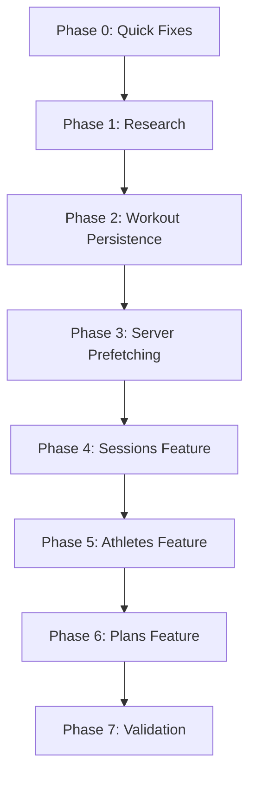
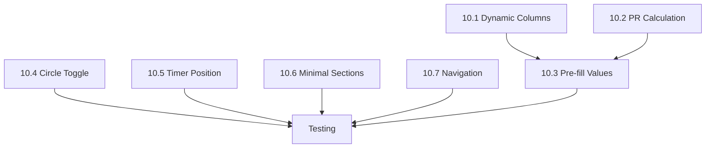

# Implementation Plan: Feature Pattern Standardization

**Branch**: `004-feature-pattern-standard` | **Date**: 2025-12-24 | **Spec**: [spec.md](./spec.md)
**Input**: Feature specification from `/specs/004-feature-pattern-standard/spec.md`

## Summary

Standardize the feature pattern across all major features (Plans, Sessions, Athletes, Workout) to ensure consistent architecture, fix critical data persistence issues in the Workout feature, and establish TanStack Query best practices for caching and mutations.

**Key Deliverables**:
1. Fix Workout data persistence (CRITICAL - data lost on page refresh)
2. Establish standard feature directory structure with hooks/, context/, types.ts
3. Implement React Query mutation pattern with optimistic updates and rollback
4. Add server prefetching with HydrationBoundary for all major pages
5. Document patterns for future feature development

## Technical Context

**Language/Version**: TypeScript 5.x + Next.js 16.0.10
**Primary Dependencies**:
- TanStack React Query 5.90.12
- Clerk 6.36.2 (authentication)
- Supabase (PostgreSQL backend)
- React Hook Form + Zod (forms)

**Storage**:
- Supabase PostgreSQL (primary)
- localStorage/IndexedDB (draft persistence)
- LRU Cache (Clerk ID to DB ID mapping)

**Testing**: Jest (unit) + Playwright (E2E)
**Target Platform**: Web (Next.js 16 App Router, Turbopack)
**Project Type**: Web application (monorepo with Turborepo)

**Performance Goals**:
- Query cache hit rate > 80%
- Zero data loss on page refresh
- Initial page load with server-prefetched data (no client waterfall)

**Constraints**:
- Next.js 16 breaking changes (no middleware auth, async params)
- Must maintain backward compatibility during migration
- No breaking changes to existing API contracts

**Scale/Scope**:
- 4 major features (Plans, Sessions, Athletes, Workout)
- ~80+ action files
- ~150+ component files

## Constitution Check

*GATE: Must pass before Phase 0 research. Re-check after Phase 1 design.*

| Principle | Status | Notes |
|-----------|--------|-------|
| Library-First | N/A | This is a refactoring feature, not a new library |
| CLI Interface | N/A | Web-only feature |
| Test-First | PARTIAL | Will add tests for new mutation hooks |
| Integration Testing | REQUIRED | Need E2E tests for data persistence |
| Simplicity | PASS | Consolidating 4 patterns into 1 standard |

**Gate Status**: PASS - No violations requiring justification

## Project Structure

### Documentation (this feature)

```text
specs/004-feature-pattern-standard/
├── plan.md              # This file
├── research.md          # Phase 0 output - caching and persistence research
├── data-model.md        # Phase 1 output - mutation and draft models
├── quickstart.md        # Phase 1 output - implementation guide
├── contracts/           # Phase 1 output - not applicable (no new APIs)
└── tasks.md             # Phase 2 output (/speckit.tasks command)
```

### Source Code (repository root)

```text
apps/web/
├── components/features/
│   ├── [feature]/
│   │   ├── components/       # Feature UI components
│   │   │   └── index.ts      # Public component exports
│   │   ├── hooks/            # Custom hooks for data/state
│   │   │   ├── index.ts      # Public hook exports
│   │   │   ├── use[Feature]Queries.ts   # Data fetching
│   │   │   └── use[Feature]Mutations.ts # Data mutations
│   │   ├── context/          # Context providers (if needed)
│   │   │   └── [Feature]Context.tsx
│   │   ├── config/           # Query keys, stale times
│   │   │   └── query-config.ts
│   │   ├── types.ts          # Feature-specific types
│   │   └── index.ts          # Public API exports
│
├── lib/
│   ├── [feature]-persistence.ts  # Draft storage (localStorage/IndexedDB)
│   └── hooks/
│       └── useUnsavedChanges.ts  # beforeunload handler
│
├── docs/patterns/
│   ├── feature-pattern.md        # Standard feature structure
│   ├── actionstate-pattern.md    # Server action pattern
│   └── hooks-vs-context.md       # Decision guide
│
└── app/(protected)/
    └── [feature]/
        └── page.tsx              # Server prefetching with HydrationBoundary
```

**Structure Decision**: Follows existing apps/web/ monorepo structure. No new projects needed - this standardizes existing feature directories.

## Complexity Tracking

No violations requiring justification. This feature reduces complexity by consolidating 4 different patterns into 1 standard.

## Phase Summary

| Phase | Focus | Output | Status |
|-------|-------|--------|--------|
| 0 | Quick Fixes | Delete unused code, fix staleTime | ✅ COMPLETE |
| 1 | Research | research.md | ✅ COMPLETE |
| 2 | Data Persistence (CRITICAL) | workout-persistence.ts, mutations | ✅ COMPLETE |
| 3 | Server Prefetching | HydrationBoundary patterns | NOT STARTED |
| 4-6 | Feature Migration | Standard structure per feature | PARTIAL |
| 7 | Validation | Tests, documentation | IN PROGRESS |
| **9** | **UI Component Migration** | **Unified training components** | **✅ COMPLETE (2025-12-25)** |
| **10** | **Athlete Workout UI Enhancements** | **Dynamic columns, pre-fill, minimal sections** | **NOT STARTED** |

## Dependencies



## Risk Assessment

| Risk | Likelihood | Impact | Mitigation |
|------|------------|--------|------------|
| Breaking existing workout flows | Medium | High | Feature flag for new persistence layer |
| Migration taking longer than expected | High | Medium | Prioritize CRITICAL Phase 2 first |
| React Query version incompatibilities | Low | Medium | Pin versions, test thoroughly |

---

## Phase 10: Athlete Workout UI Enhancements (2025-12-25)

**Goal**: Streamline the athlete workout experience with dynamic columns, pre-filled values, and minimal UI.

**Spec References**: FR-047 through FR-063

### Task 10.1: Dynamic Column Rendering

**Location**: `components/features/workout/components/exercise/`

**Implementation**:
1. Create `utils/field-visibility.ts` with logic to determine visible fields based on `session_plan_sets`
2. Scan all sets for the exercise to find which fields have non-null planned values
3. Always show `set_index` and `completed` toggle
4. Conditionally show: `reps`, `weight`, `distance`, `performing_time`, `rest_time`, `rpe`, `power`, `velocity`, `tempo`

```typescript
// utils/field-visibility.ts
export function getVisibleFields(planSets: SessionPlanSet[]): string[] {
  const fields = new Set<string>(['set_index', 'completed'])

  planSets.forEach(set => {
    if (set.reps != null) fields.add('reps')
    if (set.weight != null) fields.add('weight')
    if (set.distance != null) fields.add('distance')
    if (set.performing_time != null) fields.add('performing_time')
    if (set.rest_time != null) fields.add('rest_time')
    if (set.rpe != null) fields.add('rpe')
    if (set.power != null) fields.add('power')
    if (set.velocity != null) fields.add('velocity')
    if (set.tempo != null) fields.add('tempo')
  })

  return Array.from(fields)
}
```

### Task 10.2: PR-Based Target Generation

**Location**: `actions/workout/`, `lib/pr-calculator.ts`

**Implementation**:
1. Create `getAthletePersonalBestAction(athleteId, exerciseId)` server action
2. Create `lib/pr-calculator.ts` for target value computation
3. For strength: `targetWeight = PR * (effort / 100)`
4. For sprint: `targetTime = PR / (effort / 100)` (faster = lower time)
5. Integrate into workout session initialization

```typescript
// lib/pr-calculator.ts
export function calculateTargetWeight(pr: number, effortPercent: number): number {
  return Math.round(pr * (effortPercent / 100))
}

export function calculateTargetTime(pr: number, effortPercent: number): number {
  // At 100% effort, target equals PR. At lower effort, time is slower
  return +(pr / (effortPercent / 100)).toFixed(2)
}
```

### Task 10.3: Pre-fill Workout Sets with Planned Values

**Location**: `components/features/workout/context/exercise-context.tsx`

**Implementation**:
1. When workout starts, populate `workout_log_sets` with values from `session_plan_sets`
2. If PR calculation applies, use calculated value instead
3. Track `isModified` flag for each set to show visual indicator
4. Visual: Subtle background tint or icon for "following plan" vs "modified"

### Task 10.4: Exercise Circle Complete-All Toggle

**Location**: `components/features/workout/components/exercise/exercise-card.tsx`

**Implementation**:
1. Make the exercise index circle (currently decorative) tappable
2. On tap: If all sets pending → mark all completed; If all completed → mark all pending
3. Use existing `updateExercise` or `updateSet` mutations
4. Add subtle animation on toggle (scale/check animation)

```tsx
<button
  onClick={handleToggleAllSets}
  className="..."
>
  {allSetsCompleted ? <Check /> : exerciseIndex}
</button>
```

### Task 10.5: Timer Positioning Fix

**Location**: `components/features/workout/components/pages/workout-session-dashboard.tsx`

**Implementation**:
1. Move timer component to the LEFT of % complete in session header
2. Layout order: `[Timer] [% Complete] [Save] [Finish]`
3. Timer should have fixed width to prevent layout shift

### Task 10.6: Minimal Section Separators

**Location**: `components/features/workout/components/exercise/exercise-type-section.tsx`

**Implementation**:
1. Replace current Card-based section headers with minimal separator line
2. Optional: Small text label above line (e.g., "Sprint")
3. Remove section-level progress bars and "Mark All" buttons
4. Grouping logic in `exercise-grouping.ts` remains unchanged

```tsx
// Before each new section type, render:
<div className="flex items-center gap-2 my-4">
  <span className="text-xs text-muted-foreground uppercase tracking-wide">
    {sectionLabel}
  </span>
  <div className="flex-1 h-px bg-border" />
</div>
```

### Task 10.7: Workout Page Navigation Clarity

**Location**:
- `app/(protected)/workout/page.tsx`
- `components/features/workout/components/pages/workout-page-content.tsx`
- `components/features/workout/components/pages/workout-session-dashboard.tsx`

**Implementation**:
1. `/workout` page:
   - Show "Continue Workout" card prominently if ongoing session exists
   - List today's assigned sessions with clear date
   - "Start" button calls `startTrainingSessionAction()` then redirects

2. `/workout/[id]` page:
   - "Back to Workouts" → `router.push('/workout')` (not browser back)
   - Clear session status indicator (ongoing/completed)

### Task Dependencies



### Estimated Effort

| Task | Complexity | Estimate |
|------|------------|----------|
| 10.1 Dynamic Columns | Medium | 2-3 hours |
| 10.2 PR Calculation | Medium | 2 hours |
| 10.3 Pre-fill Values | Medium | 2-3 hours |
| 10.4 Circle Toggle | Low | 1 hour |
| 10.5 Timer Position | Low | 30 min |
| 10.6 Minimal Sections | Medium | 2 hours |
| 10.7 Navigation | Low | 1 hour |

**Total**: ~11-13 hours
